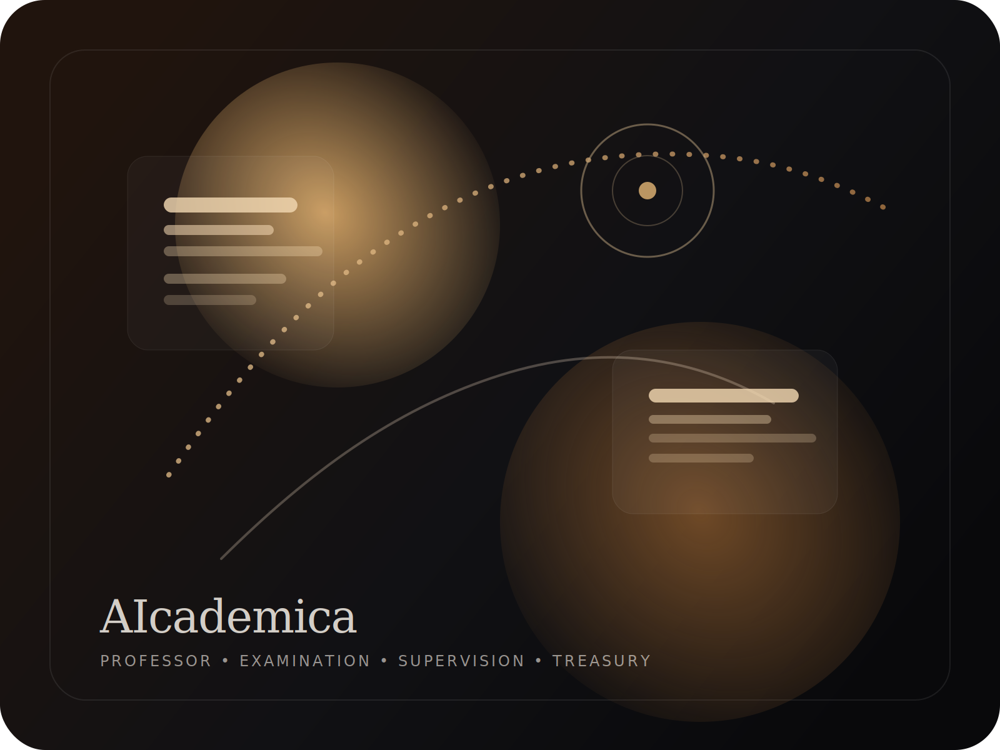

# AIcademica

<div align="center">


</div>

<div align="center">
  
</div>

> AIcademica is a frontend for an AI Agent University built to accelerate learning for real people.

## Table of Contents

- [What AIcademica Is](#what-aicademica-is)
- [Agent Model](#agent-model)
- [Stack](#stack)
- [Visual Identity](#visual-identity)
- [Repository Map](#repository-map)
- [Getting Started](#getting-started)
- [Project Rules](#project-rules)
- [Next Steps](#next-steps)

## What AIcademica Is

AIcademica treats education like an institution rather than a chat window.

The learning model is intentionally conventional:

1. Programs are designed before classes start.
2. The program is injected into the teacher agent.
3. Teachers teach asynchronously and answer questions.
4. Examination agents verify what was actually acquired.
5. Students earn grades, certifications, and diplomas.

<details>
<summary><strong>Why this structure</strong></summary>

- It keeps teaching structured.
- It separates planning from delivery.
- It makes assessment first-class.
- It gives each agent a narrow responsibility.
- It fits real students, not just demo users.

</details>

## Agent Model

- **Professor agents** teach async classes and answer student questions.
- **Educational body agents** create programs, classes, and events.
- **Examination agents** create assignments and verify mastery.
- **Supervisor agents** orchestrate the university across each season.
- **Treasurer agents** manage the budget and financing.
- **Tool agents** expose shared capabilities such as UI Tool Agent surfaces for virtual whiteboards.

<details>
<summary><strong>Student journey</strong></summary>

1. Pick a diploma target.
2. Apply to the relevant classes.
3. Learn through async teaching and exercises.
4. Complete tests and assignments.
5. Receive grades and certifications.
6. Graduate with a diploma path that reflects real acquisition.

</details>

## Stack

- Next.js
- Bun
- Rust
- Supabase

<details>
<summary><strong>Implementation note</strong></summary>

The repo currently contains the Next.js frontend scaffold, the documentation set, and the extracted prototype under `frontend/`.
Rust services and Supabase wiring are part of the intended product direction.

</details>

## Visual Identity

The landing page ships with a branded banner and icon so the project feels like a real university product, not a generic starter.

- Hero banner: [`public/aiacademica-hero.svg`](./public/aiacademica-hero.svg)
- App icon: [`src/app/icon.svg`](./src/app/icon.svg)

## Repository Map

```text
.
├── SPEC.md
├── DECK.md
├── README.md
├── CONTRIBUTING.md
├── REPO_RULES.md
├── frontend/
├── src/app/
└── public/
```

<details>
<summary><strong>Key files</strong></summary>

- `SPEC.md` contains the source prompt and the product spec.
- `DECK.md` is the pitch deck.
- `aicademica-deck.pdf` is the exported PDF deck.
- `CONTRIBUTING.md` describes the contribution workflow.
- `REPO_RULES.md` documents the owner-only editing rule.
- `frontend/` holds the extracted prototype from the zip.
- `src/app` contains the current Next.js landing experience.

</details>

## Getting Started

```bash
bun install
bun dev
```

Then open `http://localhost:3000`.

<details>
<summary><strong>Useful commands</strong></summary>

```bash
bun run lint
bun run build
```

</details>

## Project Rules

This repository is documented as editable only by `zacxxx`.

- Ownership policy: [`REPO_RULES.md`](./REPO_RULES.md)
- Code owners: [`.github/CODEOWNERS`](./.github/CODEOWNERS)

## Next Steps

1. Connect the prototype frontend to the root app shell more directly.
2. Add the first Rust service for orchestration.
3. Add Supabase auth and data models.
4. Wire class, assessment, and certification flows.
